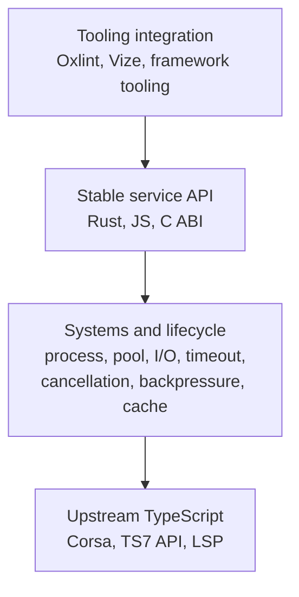

# Architecture Charter

This document states what `corsa-bind` is for, what it owns, and — more
importantly — what it must never own.

It sits above [project_guide.md](./project_guide.md): the project guide explains
how the crates fit together today, this charter explains which changes are
allowed to happen to them tomorrow.

## Position

> `corsa-bind` is a stable systems interface for the native TypeScript compiler.

Not a compiler. Not a reimplementation of the Compiler API. Not a competitor to
whatever upstream ships next.

The original argument for this repository included "typescript-go does not have
a usable programmatic API yet." That argument is expiring. Upstream is building
snapshots, build orchestration, batched RPC, workspace diagnostics, a native
LSP, and a virtual filesystem, and it will keep going. Anything `corsa-bind`
builds that competes with that will lose, because upstream owns the checker's
internal representation and its lifecycle rules and we do not.

This is not a threat to the project. It is the project getting smaller and more
important at the same time. As upstream's API matures, `corsa-bind` should get
*thinner*, not wider.

## The Boundary

> **Own integration, not TypeScript semantics.**

This sentence belongs directly after **no forks, no patches** in the list of
things this repository will not trade away. Concretely:

| Concern                                        | Owner          |
| ---------------------------------------------- | -------------- |
| What a type *means*                            | upstream       |
| What is assignable to what                     | upstream       |
| How a project graph is built                   | upstream       |
| How a snapshot is invalidated internally       | upstream       |
| Which process answers a query                  | **corsa-bind** |
| When that process starts, restarts, and dies   | **corsa-bind** |
| How long a snapshot handle stays alive         | **corsa-bind** |
| What a foreign host is allowed to ask          | **corsa-bind** |
| What the API still looks like after an upgrade | **corsa-bind** |

Said the short way: **checker semantics are never ours, checker lifecycle is
aggressively ours.**

## Layers



Every layer above the bottom one is ours to design. The bottom one is ours to
*use*, exactly as upstream intends it to be used.

## Rules

### 1. The stable API layer is the product

Upstream's API will change shape, and repeatedly. Snapshot ownership alone is
being reworked right now. If every consumer — Vize, Oxlint plugins, Rust tools,
Node tools — has to follow each of those moves, the ecosystem pays the upgrade
cost N times.

`corsa-bind` pays it once.

The endpoint-mirroring surface (`ApiClient`, `ProjectSession`) intentionally
tracks upstream naming, so new upstream capability is cheap to expose and easy
to audit. The stable surface is separate and ours:
[`SemanticQuery`](../src/core/corsa_client/src/api/semantics.rs), reached
through `ProjectSession::semantics()`, and versioned by
`SEMANTIC_QUERY_VERSION`.

```rust
let facts = project.semantics();

let symbol = facts.symbol_at(file, position).await?;
let value_type = facts.type_of(&symbol.id).await?;
```

If upstream renames `getTypeOfSymbol`, `type_of` does not move. That is the
whole contract: **`corsa-bind` owns how you ask, upstream owns what the answer
means.**

Adding an endpoint mirror is routine. Adding a stable-surface method is a
commitment, so keep that vocabulary small and answer-shaped.

### 2. Snapshots wrap upstream, they never reimplement it

`ManagedSnapshot` owns a *handle*: its cache identity, its lifetime, its
eviction, its release-on-drop, its pool affinity, its transport. It does not
own what a snapshot contains or when the checker considers it stale.

The moment upstream makes snapshots a first-class API, the correct move is to
keep `ManagedSnapshot` as the lifetime wrapper and let it reference the upstream
handle. Two parallel snapshot models is the failure state.

The same applies to path handling. If upstream introduces a canonical path
representation, `corsa-bind` converts to it at the boundary. It does not grow a
second normalization dialect.

### 3. The process boundary stays

Once upstream ships a comfortable API, "why not just call Go directly over FFI?"
becomes an obvious question. The answer is no.

The subprocess buys, all at once:

- Go runtime and GC isolation
- crash isolation — a checker crash is not a Node crash
- ABI independence
- TypeScript-version isolation
- timeouts, cancellation, restart, memory kill, worker replacement

For an editor or a long-lived lint daemon, those are the properties that decide
whether the thing is usable at 6pm on a Friday. **Process isolation is a
feature**, and it should be advertised as one rather than apologized for.

### 4. Worker and session orchestration is the killer feature

The product is not "we can spawn Corsa." The product is:

```text
acquire_project
  query
  query
  refresh
  query
release
```

Behind that: project affinity, worker reuse, snapshot reuse, query caching,
bounded queues, timeouts, restart. Upstream is not obliged to solve any of it,
because it is building a compiler service; `corsa-bind` is building the runtime
service on top.

This is why `ApiOrchestrator::acquire_project` pins a project to one warm worker
rather than round-robining it across the fleet: the program graph belongs to a
process, so spreading one project across three workers pays for the same graph
three times.

### 5. Virtual documents and virtual projects stay ours

`Foo.vue` cannot be handed to TypeScript. Something has to produce the virtual
TypeScript, keep the mapping, replace it incrementally, and own the plugin
lifecycle:

```text
Foo.vue → virtual .ts → snapshot → mapping → type graph
```

A VFS in upstream does not remove that job — virtual file generation, source
mapping, incremental replacement, and language ownership are the framework
side's responsibility, and `corsa-bind` is where the framework side meets the
checker. `VirtualDocument`, `LspOverlay`, and the projection/mapping concepts
around them are permanent residents, not scaffolding.

### 6. Foreign ASTs ask for facts; they do not import the checker's AST

`typescript-eslint` is slow in a structural way: ESTree → parser services →
Program → checker. The type-aware Oxlint path here is deliberately the other
shape:

```text
OXC AST
   ├── syntactic rules
   └── Corsa fact queries → semantic rules
```

The lint host walks its own AST and asks narrow questions. The checker's AST is
never adopted as the lint AST. `corsa-bind`'s future is *"query TypeScript
semantic facts from a foreign AST"*, not *"export the TypeScript AST to every
language."*

### 7. Export opaque handles, not a mirrored object graph

As upstream's API gets richer, the temptation is to bind `Type`, `Symbol`,
`Node`, `Signature`, and `Program` into every target language. That is a trap:
a Rust mirror of the checker's type representation breaks every time the
internal representation moves, and it makes Go GC and snapshot lifetimes
somebody else's problem in the worst possible way.

What crosses the boundary is identity only —
`SnapshotHandle`, `ProjectHandle`, `TypeHandle`, `SymbolHandle`,
`SignatureHandle`, `NodeHandle` — plus whatever the caller explicitly asked to
have rendered.

**FFI object graph: no. Query service: yes.**

`SemanticQuery` follows this literally: it answers with handles, plus at most
the display name or rendering Corsa already sent along. Consumers that want the
full upstream-shaped payload can still reach `ApiClient`, and in doing so they
knowingly accept upstream's churn.

### 8. Distributed orchestration is out of scope

Checker workloads have strong affinity to a repo, its project graph, and mutable
snapshot state. That makes them a poor fit for a stateless "any node can serve
any request" service, so replicating snapshots through Raft is not where the
value is.

The far better investment is making a single machine excellent:

```text
one machine
  ├ worker 1 — project A
  ├ worker 2 — project B
  ├ worker 3 — project C
  └ worker 4 — spare
```

When scale genuinely demands more, the answer is repo-level sharding —
repo A to machine A, repo B to machine B — not consensus over checker state.

This rule was applied to the repository itself in 2.0: the
`experimental-distributed` cargo feature, `DistributedApiOrchestrator`, the
in-process Raft implementation, the replicated-state model, and the
`CorsaDistributedOrchestrator` N-API class were all deleted — roughly 3,400
lines. Nothing replaced them, because nothing needed to. What remains is
`ApiOrchestrator`: pooling, project affinity, leases, and caches on one machine.

Keeping a consensus implementation alive "just in case" is exactly the sunk-cost
pattern the convergence rule below exists to prevent. Should a real distributed
requirement appear, it starts from repo-level sharding and gets designed against
that requirement, not resurrected from git history.

### 9. The C ABI is the core; language bindings are tiered

Hand-maintaining first-class bindings for every language does not scale. One
stable C ABI does.

```text
corsa core
    │
    ▼
stable C ABI
    ├ Rust      (tier 1)
    ├ Node/napi (tier 1)
    ├ Go        (tier 2)
    ├ Swift     (tier 2)
    ├ Zig       (tier 2)
    ├ C#        (tier 2)
    ├ C++       (tier 2)
    ├ Elixir    (tier 2)
    └ MoonBit   (tier 2)
```

Tier 1 is Rust, Node, and the C ABI itself: covered by the required CI matrix,
and where API design decisions are made. Tier 2 wrappers are welcome and
maintained on a best-effort basis on top of the C ABI; they do not get to shape
the core API. See [support_policy.md](./support_policy.md) for the current
commitment per tier.

## The Convergence Rule

> **When upstream ships it, delete ours and wrap theirs.**

This is the rule that keeps the charter honest over time. When upstream lands a
real snapshot API, a real VFS, a real build orchestrator, or real workspace
diagnostics, the correct response is not to keep a competing implementation
alive out of sunk cost.

The checklist for that moment:

1. Does upstream's version answer the same questions?
2. Can our lifecycle wrapper sit on top of it without duplicating its state?
3. Can our stable API keep its current signatures over it?
4. If yes to all three: delete the implementation, keep the wrapper, keep the
   public surface, and note the swap in the release notes.

A `corsa-bind` release whose headline is "we deleted 2,000 lines because
upstream now does this properly" is a **good** release.

## What This Does Not Mean

- It does not mean thin wrappers only. Pooling, caching, cancellation,
  backpressure, and observability are real engineering and they are ours.
- It does not mean upstream is always right. Where behavior is wrong, the
  answer is an upstream issue, not a local patch — see **no forks, no patches**.
- It does not mean the endpoint-mirroring API is deprecated. It stays as the
  fast path to new upstream capability, and as the escape hatch for callers who
  accept the churn.
- It does not mean shipping less. It means the surface grows sideways, into
  integration and lifecycle, instead of downwards into the checker.

## Reading Order

1. [README.md](../README.md) — what the project is
2. this charter — what the project refuses to become
3. [project_guide.md](./project_guide.md) — how the crates implement it
4. [support_policy.md](./support_policy.md) — what is actually supported
